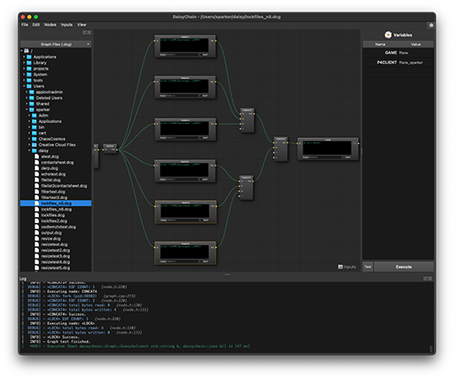

[](https://github.com/threadkill/daisychain/releases/tag/win-latest)
[](https://github.com/threadkill/daisychain/releases/tag/macos-latest)

# DaisyChain

<p align="right"><a href="docs/daisychain.png"></a></p>

#### Contents:

1. [What?](#what)
2. [Why?](#why)
3. [How?](#how)
4. [Downloads](#downloads)
5. [Examples](#examples)
6. [Building](#building)
7. [Development](#development)
8. [daisy --help](#daisyhelp)

<br/>
<br/>

## What?<a id='what'></a>

DaisyChain is a node-based dependency graph for executing programs which typically involve file processing (basically a GUI for the command line). The GUI supports drag-n-drop for files (*both graphs and file inputs*). Nodes in the graph can be executed in serial or parallel. There is also a separate command-line application for running graphs in a headless environment.

The primary node type is the CommandLine node which runs programs in a shell environment. Executables run by this node are __NOT__ required to support UNIX pipeline semantics (e.g. read STDIN, write STDOUT). The graph functions like [xargs](https://www.man7.org/linux/man-pages/man1/xargs.1.html#EXAMPLES) in that regard. However, standard output can be captured and used as input. The graph itself simply passes string tokens along and waits for the nodes to finish.

The project consists of the following components:

* __daisy__ - command-line application for executing graphs and setting inputs and options.
* __chain__ - GUI application for creating and executing graphs.
* __libdaisychain__ - the core library.
* __pydaisychain__ - the Python module that provides bindings for the core library.

<br/>

## Why?<a id='why'></a>
Fundamentally, it's easier/quicker to author command-line tools than GUI-based tools for simple file-processing tasks. DaisyChain just provides some basic GUI conveniences for those tools while adding the ability to parallelize certain tasks.

1. *Batch processing* files typically requires writing the same type of boilerplate code in a scripting language over and over again (*i.e. option flags, loops constructs, exec calls to other applications, I/O handling, signal handling, etc*). DaisyChain replaces that process with a framework that controls the order of execution, **and provides a means to parallelize processes.**
2. *Running scripts* requires some working knowledge of a terminal and shell syntax. DaisyChain encapsulates that
process in a GUI application which does not require terminal interaction by users.
3. It's easier to *distribute tools* by encapsulating them in a graph along with their parameters.

<br/>

## How?<a id='how'></a>

DaisyChain uses a directed-acyclic-graph (DAG) to control the order of operations. Nodes in the graph read inputs, do some processing, and then write the outputs. Inputs are typically file paths but could be any string token (e.g. a range of numbers). A node will execute once per token until all tokens have been received. Some nodes can wait and process all tokens at once. Token strings can be modified as they pass through the graph.

Each node runs as a child process. All synchronization between nodes is handled using named pipes and multiplexed I/O. This allows processes to run in parallel.

Graphs are stored as JSON in a *.dcg file that encapsulates all the commands and parameters (but not the inputs).

The current set of executable nodes includes:

* __CommandLine__ - executes external programs via shell environment.
* __Filter__ - provides string matching via globbing or regular expressions.
* __Concat__ - concatenates multiple inputs into a single output.
* __Distro__ - facilitates parallel processing by distributing tokens across multiple outputs in round-robin fashion, skipping busy outputs.
* __FileList__ - converts a text file into input line-by-line.
* __Watch__ - polls for changes to directories/files and writes the modified filenames to the outputs.

__Options__ are passed to nodes via variables that can be set in the __Variables__ panel in
the GUI or set using flags from the command-line tool. These are effectively environment variables.

__Processing__ happens one string token at a time. Nodes loop over tokens and execute once per token. This behavior can be changed by checking the __`batch`__ checkbox (*when a node supports it*); in which case, a node will __block__ until it has received all inputs which are then concatenated into one large string and set as the input for the node.

__Parallel processing__ can be achieved by duplicating a set of nodes and using a __`distro`__ node to distribute tokens across each group of nodes. This would typically be followed by using a __`concat`__ node to bring the inputs back into a single stream.

__I/O__ from node to node are string tokens represented by the ```${INPUT}``` and ```${OUTPUT}``` variables.
The ```${OUTPUT}``` variable is automatically set equal to the ```${INPUT}``` variable. This leaves the string token intact as it passes through the graph. However, the ```${OUTPUT}``` variable can be changed via shell string
substitution patterns in the ```${OUTPUT}``` field of a node (*if present*). Additionally, for CommandLine nodes,
```${OUTPUT}``` can be set to ```${STDOUT}```.

__Notes__ can be stored with the graph and displayed in the GUI.

<br/>

## Downloads<a id='downloads'></a>

Binaries are currently available for [Windows10+ (x86_64)](https://github.com/threadkill/daisychain/releases/download/win-latest/DaisyChain-win-latest-win64.exe) and  [macOS-13+ (arm64)](https://github.com/threadkill/daisychain/releases/download/macos-latest/DaisyChain-macos-latest.dmg).

<br/>

## Examples<a id='examples'></a>

There is a separate [repository](https://github.com/threadkill/daisychain-graphs) with some example graphs. The [wiki](https://github.com/threadkill/daisychain-graphs/wiki) outlines usage.

<br/>

## Building<a id='building'></a>

The project was originally developed for __macOS__ and __Linux__ but was ported to __Windows__ more recently. The Linux and macOS implementation uses fork()'s, while Windows uses threads.

It is possible to build on __Windows 10/11__ using __WSL2__ (*e.g. Debian*) but very limited testing has been done. For best performance, make sure all working files are located on the Linux file system (e.g. *NOT* `/mnt/c`). At a minimum, these packages are needed for WSL2: `git`, `gcc`, `cmake`, `qt6`, `qt6-base-dev`, `qt6-base-dev-tools`, `python3-dev`, `libxkbcommon-dev`.

#### Requirements

The project attempts to leverage as many existing technologies as possible without creating too many run-time
dependencies. Most dependencies are included in the project as git submodules. It is *highly* recommended to use
CMake to build the project.

Dependencies:

* [CMake 3.18+](https://cmake.org) or [Autoconf 2.7+](https://www.gnu.org/software/autoconf/autoconf.html)

Git Submodules (header-only dependencies):

* [Templatized C++ Command Line Parser Library (TCLAP)](https://tclap.sourceforge.net/)
* [Easylogging++](https://github.com/abumq/easyloggingpp)
* [JSON for Modern C++](https://github.com/nlohmann/json)
* [pybind11](https://github.com/pybind/pybind11)
* [pybind11_json](https://github.com/pybind/pybind11_json)

GUI Dependencies:

* [Qt6](https://www.qt.io/product/framework) (not included as a git submodule)
* [NodeEditor](https://github.com/paceholder/nodeeditor)

#### CMake

1. ```git clone --recurse-submodules git@github.com:threadkill/daisychain.git```
1. ```mkdir -p daisychain/build && cd $_```
1. ```cmake .. -DCMAKE_BUILD_TYPE=RelWithDebInfo -DCMAKE_INSTALL_PREFIX=<install dir> -DCMAKE_PREFIX_PATH=<Qt6_Root>/<arch>```
1. ```cmake --build . --target install -j```

	*individual build targets:* __*daisy, chain, libdaisychain, pydaisychain*__

#### Autotools (macOS and Linux)

*The configure scripts currently only support building the library (__libdaisychain__) and the command-line application (__daisy__). When building the GUI application (chain) or the python bindings (pydaisychain), use the CMake buildscripts.*

1. ```git clone --recurse-submodules git@github.com:threadkill/daisychain.git```
1. ```cd daisychain```
1. ```./bootstrap```
1. ```mkdir build && cd $_```
1. ```../configure --prefix=<install dir>```
1. ```make -j5 install```

	*individual build targets:* __*daisy, libdaisychain*__
    
##### *Notes*

* *There are no run-time dependencies for `libdaisychain` or `daisy`; all dependencies are header-only.*
* *Qt6 is not linked to by the commandline tool `daisy` and does not need to be present on a server or headless environment.*
* *[NodeEditor](https://github.com/paceholder/nodeeditor) is used to create nodes and establish connections. Data flow functionality is not used.*

<br/>

## Development<a id='development'></a>

#### Debugging (macOS and Linux)
Debugging forked processes can be challenging and typically requires a debugger that can follow forks. The graph uses an
initial fork to establish the process leader for the group and subsequent forks for each node in the graph. This is how tasks
are parallelized and facilitates signal processing via process group.

The __*utils.h*__ header includes a function called ```m_debug_wait()``` that does not require following forks in the debugger.
Place that function in the node's ```Execute()``` method and call with a ```true``` value; the node will wait and the log will
print the __pid__ for the node. You can then attach the debugger to that process (*via pid*), hit *pause/break*, set the
```wait``` variable to ```false```, and continue by stepping. Wrap the ```m_debug_wait()``` call in an ```if``` statement against the
node name to be sure you're in the exact node you're trying to debug.

##### Example

```c++
    if (name_ == "MyCommand1")
        m_debug_wait(true);
```

<br/>

## daisy --help<a id='daisyhelp'></a>

<br/>

```text
DaisyChain - node-based dependency graph for file processing.
   
USAGE:

   ./daisy  [-l <level>] [--stdin] [--keep] [-e <key=value>] ... [-s
            <sandbox directory>] -g <graph *.dcg> [--] [--version] [-h]
            <filename> ...


Where:

   -l <level>,  --loglevel <level>
     off, info, warn, error, debug

   --stdin
     read from STDIN

   --keep
     keep sandbox

   -e <key=value>,  --environ <key=value>  (accepted multiple times)
     Shell variables inherited by the execution process.

   -s <sandbox directory>,  --sandbox <sandbox directory>
     Working directory used for I/O and available as a shell variable
     during execution ${SANDBOX}.

   -g <graph *.dcg>,  --graph <graph *.dcg>
     (required)  DaisyChain graph file to execute.

   --,  --ignore_rest
     Ignores the rest of the labeled arguments following this flag.

   --version
     Displays version information and exits.

   -h,  --help
     Displays usage information and exits.

   <filename>  (accepted multiple times)
     Inputs (typically files).
```
